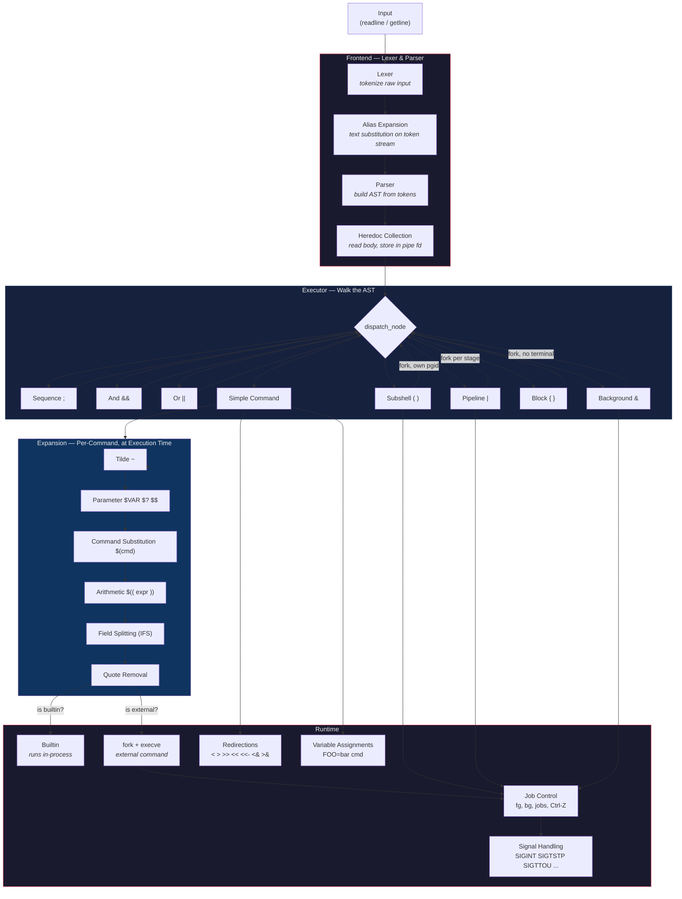

[](https://github.com/leowz/42sh/actions/workflows/ci.yml)

# 42sh

A POSIX-flavoured shell written in C from scratch at 42 School. Features
interactive line editing (readline), command history, job control, pipelines,
here-documents, aliases, arithmetic expansion, and a full variable/environment
system -- all built on top of a custom `libft`.

> **[API Documentation](https://leowz.github.io/42sh/docs/)**  &nbsp;|&nbsp;  **[AST Visualizer](https://leowz.github.io/42sh/viz/)**

---

## Architecture



### Processing Pipeline

| Phase | When | What happens |
|-------|------|--------------|
| **Lexer** | Immediately on input | Splits raw text into tokens (`WORD`, `PIPE`, `REDIR_OUT`, `LPAREN`, ...). Quotes are preserved as-is for later expansion. |
| **Alias Expansion** | After lexing, before parsing | Pure token-stream rewriting. A `WORD` in command position matching an alias is replaced by the re-tokenized alias value. Runs before the parser because aliases can introduce syntax (`alias begin='{'`). |
| **Parser** | After alias expansion | Builds an AST: `SEQUENCE`, `AND`/`OR`, `PIPE`, `SUBSHELL`, `BLOCK`, `BACKGROUND`, and `COMMAND` nodes. Heredoc bodies are collected here. |
| **Executor** | Tree-walk of the AST | Dispatches each node type. Compound nodes (`; && \|\| \|`) recurse. Groups (`()` `{}` `&`) fork or scope redirections. |
| **Word Expansion** | Per simple command, just before exec | `~` -> tilde, `$VAR` -> parameter, `$(cmd)` -> command substitution, `$((...))` -> arithmetic, then IFS field-splitting and quote removal. Happens at execution time because values depend on runtime state (`$?`, modified variables, command output). |
| **Execution** | After expansion | Builtins run in-process. External commands fork+execve through the job-control machinery. Redirections are applied, assignments are scoped. |

### Why aliases expand early, but `$VAR` expands late

**Aliases** are syntactic sugar -- they rewrite the token stream and can change
the grammar itself (e.g. `alias begin='{'`). The parser must see the rewritten
tokens, so alias expansion happens *between* the lexer and the parser.

**Word expansion** (`$VAR`, `$(cmd)`, `$((...))`, tilde, field splitting)
depends on runtime state: variable values change between commands, `$?` reflects
the previous exit status, and command substitution must execute commands. POSIX
mandates that these expansions occur at execution time, not at parse time.

---

## Features

### Shell Grammar
- Sequences (`;`), logical operators (`&&`, `||`)
- Pipelines (`|`, up to 256 stages)
- Subshells `( cmd )`, brace groups `{ cmd; }`
- Background execution (`&`)
- Here-documents (`<<`, `<<-` with tab stripping)
- Redirections (`<`, `>`, `>>`, `<&`, `>&`, fd duplication)

### Expansion
- Tilde expansion (`~`, `~user`)
- Parameter expansion (`$VAR`, `${VAR}`, `$?`, `$$`, `$!`)
- Command substitution (`$(cmd)`)
- Arithmetic expansion (`$(( expr ))`)
- Field splitting (IFS-aware)
- Quote removal (single, double, backslash)

### Builtins
| Builtin | Description |
|---------|-------------|
| `echo` | Print arguments (`-n`, `-e`, `-E`) |
| `cd` | Change directory (`-L`, `-P`) |
| `pwd` | Print working directory (`-L`, `-P`) |
| `export` | Mark variables for child environments |
| `unset` | Remove variables |
| `set` | Display or set variables |
| `exit` | Exit the shell |
| `type` | Describe command resolution (`-t`, `-p`, `-a`) |
| `alias` / `unalias` | Manage command aliases |
| `hash` | Manage PATH lookup cache (`-r`, `-d`, `-p`, `-t`) |
| `history` | Display command history |
| `jobs` | List active jobs |
| `fg` / `bg` | Resume jobs foreground / background |
| `test` | Evaluate conditional expressions |

### Job Control
- Process groups per pipeline / subshell
- Terminal ownership management (`tcsetpgrp`)
- `Ctrl-Z` (suspend), `Ctrl-C` (interrupt)
- Background jobs (`&`), `fg`, `bg`, `jobs`
- Async notification of completed/stopped background jobs

### Interactive
- GNU Readline integration (line editing, tab completion)
- Persistent command history (`$HISTFILE`)
- Signal handling (SIGINT, SIGTSTP, SIGTTOU, SIGTTIN, SIGPIPE)

---

## Building

```bash
make            # Build 42sh
make debug      # Build with ASan + UBSan + -DDEBUG
make test       # Compile and run unit + integration tests
make clean      # Remove object files
make fclean     # Remove objects, binaries, and generated docs
make re         # Full rebuild
```

> **Dependencies**: `gcc` (or `c99`), `libreadline-dev`, `libncurses-dev`

## Makefile Reference

| Target | Description |
|--------|-------------|
| `make` / `make all` | Build `42sh` |
| `make debug` | Build with ASan, UBSan, and `-DDEBUG` |
| `make test` | Compile and run the unit test suite |
| `make docs` | Generate Doxygen man pages |
| `make html` | Convert man pages to HTML |
| `make serve` | Build HTML docs and serve at `http://localhost:8080` |
| `make clean` | Remove object files |
| `make fclean` | Remove objects, binaries, and generated docs |
| `make re` | `fclean` then `all` |

---

## Testing

### Unit Tests

Tests live in `tests/` and compile into `42sh_test`, separate from the shell binary.

```bash
make test
```

The framework is a single header (`tests/minunit.h`) with no dependencies:

| Macro | Purpose |
|-------|---------|
| `MU_ASSERT(msg, expr)` | Fail if `expr` is zero |
| `MU_ASSERT_INT(expected, actual)` | Fail if two `int` values differ |
| `MU_ASSERT_STR(msg, expected, actual)` | Fail if two strings differ (NULL-safe) |
| `MU_RUN(suite_fn)` | Run a suite function |
| `MU_SUMMARY()` | Print totals, return `0`/`1` |

### Integration Tests

```bash
bash tests/integration/run.sh
```

Runs 60+ cases covering redirections, pipes, heredocs, subshells, signal
handling (SIGPIPE / broken-pipe), and compares output against `bash --posix`.

---

## CI / CD

Every push and pull request runs `make test` on Ubuntu via GitHub Actions.
On `main`, a passing build triggers `make html` and deploys the API docs to
GitHub Pages.

See [`.github/workflows/ci.yml`](.github/workflows/ci.yml).

---

## Project Structure

```
42sh/
├── srcs/
│   ├── main.c                  # Entry point, REPL loop
│   ├── input.c                 # Unified stdin reader
│   ├── lexer/                  # Tokenizer
│   ├── aliases/                # Alias table + token-stream expansion
│   ├── parser/                 # Recursive-descent parser, AST construction
│   ├── expander/               # $VAR, ~, $(cmd), $((...)), field splitting
│   ├── executor/               # AST walker, fork/exec, redirections, pipes
│   ├── builtins/               # cd, echo, export, jobs, fg, bg, ...
│   ├── job_control/            # Process groups, terminal, wait, notify
│   ├── signals/                # Interactive, execution, and child handlers
│   ├── variables/              # Shell variable storage + environ cache
│   └── history/                # Readline history persistence
├── includes/                   # All header files
├── Libft/                      # Custom C standard library
├── tests/                      # Unit tests + integration suite
├── docs/                       # Generated API documentation
└── viz/                        # AST visualizer (web)
```

---

[](https://github.com/leowz/42sh/graphs/contributors)

<a href="https://github.com/leowz/42sh/graphs/contributors">
  
</a>
